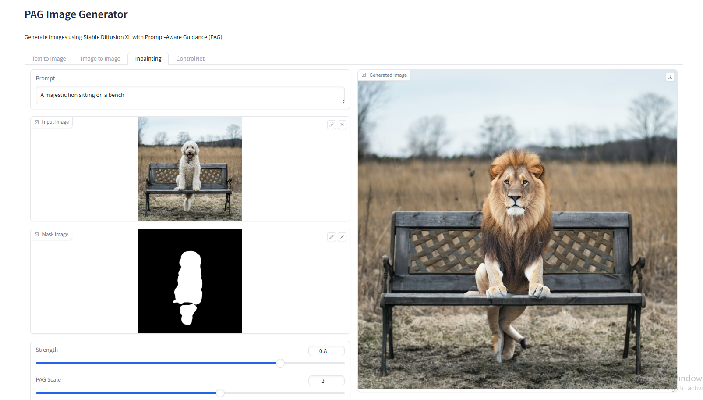

# Stable Diffusion XL with PAG Image Generator

This application uses Stable Diffusion XL with Prompt-Aware Guidance (PAG) to generate images. It demonstrates the effect of different PAG scales on image generation.

## Requirements

- Python 3.8 or higher
- CUDA-capable GPU (recommended)
- At least 8GB of VRAM

## Installation

1. Clone this repository
2. Install the required dependencies:
```bash
pip install -r requirements.txt
```

**If you want to use GPU acceleration (CUDA), install torch with CUDA support before installing other requirements:**
```bash
pip install torch==2.1.0+cu118 --index-url https://download.pytorch.org/whl/cu118
```
Then install the rest:
```bash
pip install -r requirements.txt
```

## Usage

Run the script with the default prompt:
```bash
python app.py
```

The script will:
1. Download the Stable Diffusion XL model (if not already downloaded)
2. Provide a Gradio web interface with multiple tabs (Text2Image, Image2Image, Inpainting, ControlNet)
3. Save the generated images in the `output` directory (if you add saving functionality)

## Customization

You can modify the `app.py` script to:
- Change the prompt
- Adjust PAG scales
- Modify generation parameters (steps, guidance scale, etc.)
- Change the output directory

## Output

The generated images will be displayed in the Gradio interface and can be saved manually from the UI. 